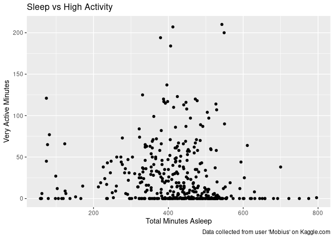

Bellabeats Case Study
================
Christian Collins
2024-05-13

## About Bellabeat

Urška Sršen and Sando Mur founded Bellabeat, a high-tech company that
manufactures health-focused smart products. Sršen used her background as
an artist to develop beautifully designed technology that informs and
inspires women around the world. Collecting data on activity, sleep,
stress, and reproductive health has allowed Bellabeat to empower women
with knowledge about their own health and habits. Since it was founded
in 2013, Bellabeat has grown rapidly and quickly positioned itself as a
tech-driven wellness company for women.

## Business Task

Sršen asks you to analyze smart device usage data in order to gain
insight into how consumers use non-Bellabeat smart devices. These
questions will guide my analysis: 1. What are some trends in smart
device usage? 2. How could these trends apply to Bellabeat customers? 3.
How could these trends help influence Bellabeat marketing strategy?

First, I want to find additional data as the
[data](https://www.kaggle.com/datasets/arashnic/fitbit) provided to me,
had a small sample size. I found additional data
[here](https://dataverse.no/dataset.xhtml?persistentId=doi:10.18710/TGGCSZ).

## Preparing Data in SQL

After I uploaded the two datasets I began getting to know the data with
the preview tab in BigQuery. Then I ran some basic queries to see if the
entries match the data description

``` r
knitr::include_graphics('/cloud/project/Bellabeat_Additional_Data_Id_Count.PNG')
```

<!-- -->

``` r
knitr::include_graphics('/cloud/project/Bellabeat_Sleep_Distinct_Id.PNG')
```

<!-- -->

Next, I noticed from previewing the tables that the columns contain the
same type of information, but different column names. I confirmed this
with the read.me files that came with the dataverse.no dataset. Also,
part of this data was collected during COVID. This would skew the
results of this data if I left those dates in, because people where in
lockdown during this time. So, to fix the formatting and filter out the
dates I did not want, I ran the following query:

``` r
knitr::include_graphics('/cloud/project/Bellabeat_Filter_Data_02.PNG')
```

<!-- -->

Now that the tables have the same formant I can merge the two with a
`JOIN` statement:

``` r
knitr::include_graphics('/cloud/project/Bellabeat_Merging_Datasets_02.PNG')
```

<!-- -->

The results show a lot of null values after I merged the datasets, because of duplicated columns. I can
use `COALESCE` to solve this:

``` r
knitr::include_graphics('/cloud/project/Bellabeat_Coalesce.png')
```

<!-- -->

This looks a lot better, however I want to double check. I can spot
check data using the following query and have a split tab open of the
dataset before it was merged to make sure the data aligns:

``` r
knitr::include_graphics('/cloud/project/Bellabeat_Spot_Checking.PNG')
```

<!-- -->

## Moving to R

Notes: setting up my R environment by uploading the relevant data,
installing and loading the `tidyverse` and `janitor` packages:

``` r
install.packages("tidyverse")
```

    ## Installing package into '/cloud/lib/x86_64-pc-linux-gnu-library/4.4'
    ## (as 'lib' is unspecified)

``` r
install.packages("janitor")
```

    ## Installing package into '/cloud/lib/x86_64-pc-linux-gnu-library/4.4'
    ## (as 'lib' is unspecified)

``` r
library(tidyverse)
```

    ## ── Attaching core tidyverse packages ──────────────────────── tidyverse 2.0.0 ──
    ## ✔ dplyr     1.1.4     ✔ readr     2.1.5
    ## ✔ forcats   1.0.0     ✔ stringr   1.5.1
    ## ✔ ggplot2   3.5.1     ✔ tibble    3.2.1
    ## ✔ lubridate 1.9.3     ✔ tidyr     1.3.1
    ## ✔ purrr     1.0.2

    ## ── Conflicts ────────────────────────────────────────── tidyverse_conflicts() ──
    ## ✖ dplyr::filter() masks stats::filter()
    ## ✖ dplyr::lag()    masks stats::lag()
    ## ℹ Use the conflicted package (<http://conflicted.r-lib.org/>) to force all conflicts to become errors

``` r
library(janitor)
```

    ## 
    ## Attaching package: 'janitor'
    ## 
    ## The following objects are masked from 'package:stats':
    ## 
    ##     chisq.test, fisher.test

## Preparing and Processing the Data in R

After I imported the data into R I ran the following code to create data
frames:

``` r
smart_device_users <- read_csv('/cloud/project/smart_device_users.csv')
```

    ## Rows: 40105 Columns: 8
    ## ── Column specification ────────────────────────────────────────────────────────
    ## Delimiter: ","
    ## dbl  (7): Id, TotalSteps, Calories, SedentaryMinutes, LightlyActiveMinutes, ...
    ## date (1): ActivityDate
    ## 
    ## ℹ Use `spec()` to retrieve the full column specification for this data.
    ## ℹ Specify the column types or set `show_col_types = FALSE` to quiet this message.

``` r
sleep_df <- read_csv('/cloud/project/sleep_dates_formatted.csv')
```

    ## Rows: 413 Columns: 5
    ## ── Column specification ────────────────────────────────────────────────────────
    ## Delimiter: ","
    ## dbl  (4): Id, TotalSleepRecords, TotalMinutesAsleep, TotalTimeInBed
    ## date (1): ActivityDate
    ## 
    ## ℹ Use `spec()` to retrieve the full column specification for this data.
    ## ℹ Specify the column types or set `show_col_types = FALSE` to quiet this message.

I have already gotten familiar with this data in SQL, but I can use
`glimpse` here to gain an understanding of the data if I hadn’t:

``` r
glimpse(smart_device_users)
```

    ## Rows: 40,105
    ## Columns: 8
    ## $ Id                   <dbl> 7007744171, 7007744171, 7007744171, 7007744171, 7…
    ## $ ActivityDate         <date> 2016-04-22, 2016-04-15, 2016-04-16, 2016-04-17, …
    ## $ TotalSteps           <dbl> 15299, 5273, 4631, 8059, 11085, 3761, 5600, 11179…
    ## $ Calories             <dbl> 2889, 2098, 2076, 2383, 2667, 2051, 2225, 2668, 2…
    ## $ SedentaryMinutes     <dbl> 1065, 1238, 1155, 1135, 1021, 1240, 1142, 1096, 1…
    ## $ LightlyActiveMinutes <dbl> 261, 202, 203, 305, 419, 200, 237, 304, 355, 337,…
    ## $ FairlyActiveMinutes  <dbl> 50, 0, 0, 0, 0, 0, 0, 6, 8, 12, 13, 14, 16, 17, 2…
    ## $ VeryActiveMinutes    <dbl> 64, 0, 0, 0, 0, 0, 0, 34, 53, 50, 44, 64, 16, 53,…

``` r
glimpse(sleep_df)
```

    ## Rows: 413
    ## Columns: 5
    ## $ Id                 <dbl> 1503960366, 1503960366, 1503960366, 1503960366, 150…
    ## $ ActivityDate       <date> 2016-04-12, 2016-04-15, 2016-04-17, 2016-04-19, 20…
    ## $ TotalSleepRecords  <dbl> 1, 1, 1, 1, 1, 1, 1, 1, 1, 1, 1, 1, 1, 1, 1, 1, 1, …
    ## $ TotalMinutesAsleep <dbl> 327, 412, 700, 304, 360, 325, 361, 430, 277, 245, 3…
    ## $ TotalTimeInBed     <dbl> 346, 442, 712, 320, 377, 364, 384, 449, 323, 274, 3…

If I’d like a deeper understanding with some statistics I can use
`summary`:

``` r
summary(smart_device_users)
```

    ##        Id             ActivityDate          TotalSteps       Calories   
    ##  Min.   :1.000e+00   Min.   :2016-04-12   Min.   :    0   Min.   :   0  
    ##  1st Qu.:2.800e+01   1st Qu.:2019-04-19   1st Qu.: 5112   1st Qu.:2021  
    ##  Median :5.800e+01   Median :2019-08-10   Median : 8625   Median :2413  
    ##  Mean   :1.138e+08   Mean   :2019-07-13   Mean   : 9213   Mean   :2344  
    ##  3rd Qu.:8.700e+01   3rd Qu.:2019-11-23   3rd Qu.:12731   3rd Qu.:2851  
    ##  Max.   :8.878e+09   Max.   :2020-02-29   Max.   :75822   Max.   :7769  
    ##  SedentaryMinutes LightlyActiveMinutes FairlyActiveMinutes VeryActiveMinutes
    ##  Min.   :   0     Min.   :  0.00       Min.   :  0.00      Min.   :  0.00   
    ##  1st Qu.:   0     1st Qu.:  0.00       1st Qu.:  0.00      1st Qu.:  0.00   
    ##  Median :   0     Median :  0.00       Median :  4.00      Median :  3.00   
    ##  Mean   : 269     Mean   : 85.42       Mean   : 15.71      Mean   : 23.38   
    ##  3rd Qu.: 618     3rd Qu.:193.00       3rd Qu.: 21.00      3rd Qu.: 37.00   
    ##  Max.   :1440     Max.   :730.00       Max.   :620.00      Max.   :608.00

``` r
summary(sleep_df)
```

    ##        Id             ActivityDate        TotalSleepRecords TotalMinutesAsleep
    ##  Min.   :1.504e+09   Min.   :2016-04-12   Min.   :1.000     Min.   : 58.0     
    ##  1st Qu.:3.977e+09   1st Qu.:2016-04-19   1st Qu.:1.000     1st Qu.:361.0     
    ##  Median :4.703e+09   Median :2016-04-27   Median :1.000     Median :433.0     
    ##  Mean   :5.001e+09   Mean   :2016-04-26   Mean   :1.119     Mean   :419.5     
    ##  3rd Qu.:6.962e+09   3rd Qu.:2016-05-04   3rd Qu.:1.000     3rd Qu.:490.0     
    ##  Max.   :8.792e+09   Max.   :2016-05-12   Max.   :3.000     Max.   :796.0     
    ##  TotalTimeInBed 
    ##  Min.   : 61.0  
    ##  1st Qu.:403.0  
    ##  Median :463.0  
    ##  Mean   :458.6  
    ##  3rd Qu.:526.0  
    ##  Max.   :961.0

Something to note is that the average person took 9,213 steps and those
who recorded sleep data slept an average of 419 minutes, or 6.98 hours.

## Exploratory Data Analysis in R

First, I’d like to see the relationship between activity and calories
burned:

``` r
ggplot(smart_device_users, aes(x=VeryActiveMinutes, y=Calories))+geom_point()+geom_smooth(method=lm, se=FALSE)+labs(title= "Calories Burned vs. Very Active Minutes", x="Very Active Minutes", caption = "Data collected from user 'Mobius' on Kaggle.com and The Artic University of Norway on dataverse.no")
```

    ## `geom_smooth()` using formula = 'y ~ x'

<!-- -->

``` r
ggplot(smart_device_users, aes(x=FairlyActiveMinutes, y=Calories))+geom_point()+geom_smooth(method=lm, se=FALSE)+labs(title = "Calories Burned vs Fairly Active Minutes", x="Fairly Active Minutes", caption = "Data collected from user 'Mobius' on Kaggle.com and The Artic University of Norway on dataverse.no")
```

    ## `geom_smooth()` using formula = 'y ~ x'

<!-- -->

``` r
ggplot(smart_device_users, aes(x=LightlyActiveMinutes, y=Calories))+geom_point()+geom_smooth(method=lm, se=FALSE)+labs(title = "Calories Burned vs Lightly Active Minutes", x="Lightly Active Minutes", caption = "Data collected from user 'Mobius' on Kaggle.com and The Artic University of Norway on dataverse.no")
```

    ## `geom_smooth()` using formula = 'y ~ x'

<!-- -->

``` r
ggplot(smart_device_users, aes(x=SedentaryMinutes, y=Calories))+geom_point()+geom_smooth(method=lm, se=FALSE)+labs(title = "Calories Burned vs Sedentary Minutes", x="Sedentary Minutes", caption = "Data collected from user 'Mobius' on Kaggle.com and The Artic University of Norway on dataverse.no")
```

    ## `geom_smooth()` using formula = 'y ~ x'

<!-- -->

Graphing all four categories of activity levels I can see that the more
active these participants were, the stronger correlation between the
activity and calories they burned was. This may be obvious, but checking
the data confirms it.

Now that I can see there is a positive correlation between more activity
and calories burned, I will see if there is a pattern that more sleep
leads to more activity.

First, I need to merge the sleep data with the activity data so that I
can plot both data on the same graph. I will merge them using the keys
`Id` and `ActivityDate`, so the the correct sleep data merges with the
corresponding activity data. I need to use both here, because if I were
to just use `Id` the dates may not align leading to skewed results.

``` r
total_data <- merge(smart_device_users, sleep_df, by=c("Id","ActivityDate"))
head(total_data)
```

    ##           Id ActivityDate TotalSteps Calories SedentaryMinutes
    ## 1 1503960366   2016-04-12      13162     1985              728
    ## 2 1503960366   2016-04-13      10735     1797              776
    ## 3 1503960366   2016-04-15       9762     1745              726
    ## 4 1503960366   2016-04-16      12669     1863              773
    ## 5 1503960366   2016-04-17       9705     1728              539
    ## 6 1503960366   2016-04-19      15506     2035              775
    ##   LightlyActiveMinutes FairlyActiveMinutes VeryActiveMinutes TotalSleepRecords
    ## 1                  328                  13                25                 1
    ## 2                  217                  19                21                 2
    ## 3                  209                  34                29                 1
    ## 4                  221                  10                36                 2
    ## 5                  164                  20                38                 1
    ## 6                  264                  31                50                 1
    ##   TotalMinutesAsleep TotalTimeInBed
    ## 1                327            346
    ## 2                384            407
    ## 3                412            442
    ## 4                340            367
    ## 5                700            712
    ## 6                304            320

Now that everything I need is in one place and looks good, I can begin
to plot the data to show the relationship between sleep and activity
levels:

``` r
ggplot(total_data, aes(x=TotalMinutesAsleep, y=VeryActiveMinutes))+geom_point()+labs(title = "Sleep vs High Activity", x="Total Minutes Asleep", y="Very Active Minutes", caption = "Data collected from user 'Mobius' on Kaggle.com")
```

<!-- -->

``` r
ggplot(total_data, aes(x=TotalMinutesAsleep, y=FairlyActiveMinutes))+geom_point()+labs(title = "Sleep vs Moderate Activity", x="Total Minutes Asleep", y="Fairly Active Minutes", caption = "Data collected from user 'Mobius' on Kaggle.com")
```

<!-- -->

``` r
ggplot(total_data, aes(x=TotalMinutesAsleep, y=LightlyActiveMinutes))+geom_point()+labs(title = "Sleep vs Light Activity", x="Total Minutes Asleep", y="Lightly Active Minutes", caption = "Data collected from user 'Mobius' on Kaggle.com")
```

<!-- -->

``` r
ggplot(total_data, aes(x=TotalMinutesAsleep, y=SedentaryMinutes))+geom_point()+geom_smooth(method=lm, se=FALSE) +labs(title = "Sleep vs Time Sedentary", x="Total Minutes Asleep", y="Sedentary Minutes", caption = "Data collected from user 'Mobius' on Kaggle.com")
```

    ## `geom_smooth()` using formula = 'y ~ x'

<!-- -->

There seems to be strong correlation between sleeping more and being
less sedentary throughout the day! Also the people who had the most
“Very Active” and “Fairly Active” minutes, slept between 390 min. and
540 min. or 6.5 - 9 hours. However, this could just be that the majority
of people sleep for this amount of time. As we noted earlier the average
time asleep was 6.98 hours.It’s important to remember that the sample
size for this sleep data is very small at only 24 participants. More
data would be needed for a stronger more complete analysis.

## Conclusion

The data collected showed a pattern that the more active someone is the
more calories they burn. Also, that there was a strong correlation
between sleeping more and being less sedentary! People who slept 6.5 - 9
hours spent the most time being active, but it is important to remember
the limitations of this data and that more data would be needed for a
better analysis. This shows that sleeping for the recommended time of
7-8 hours, as recommended from the National Institutes of Health, could
help your fitness goals of losing weight since, in these participants,
sleeping the recommended amount lead to higher activity time, and higher
activity time lead to more calories being burnt!

## Recommendations

Based on the data I recommend that Bellabeat markets to its customers
something along the lines of, “data shows that getting the recommended
hours of sleep at night could lead to being more active throughout the
day, which may help you with your fitness goals. Our Leaf and Time
smartwatch, from Bellabeat, will automatically track your night-time
sleep. Since this is done automatically, there is no need for you to
tell the device that you are going to sleep or put it in any kind of
sleep mode, making it so easy to track and manage your sleep. Reach your fitness goals easier with Bellabeat.”
